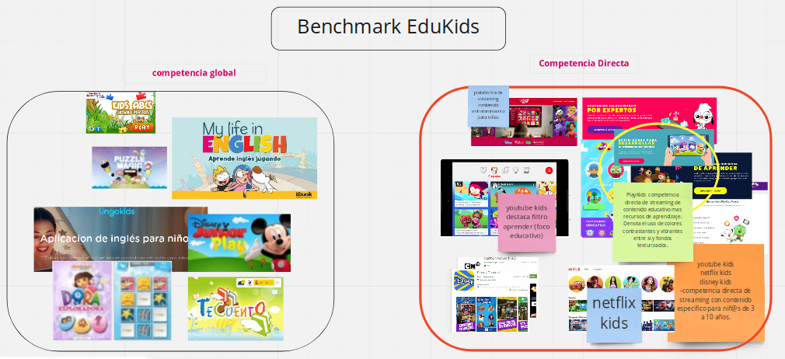

### HACKATHON SQUAD 7
 # EduKids

## Investigacion de Usuario

# Research

Como equipo llegamos al acuerdo de realizar una aplicación con contenido educativo orientado a niños de 3 a 10 años. 

Comenzamos realizando una investigacion de mercado analizando tanto a nuestra competencia directa como global.   

Dentro de nuestra competencia directa encontramos aplicaciones como:
+ netflix  
+ playkids
+ disney 
+ youtube kids

 Al observar estos productos digitales,    podemos destacar la utilización de colores vibrantes como rojos,  amarillos,  verdes,   calipsos. Estructuras UI clasicas de diseño horizontal y exponiendo la navegación.

 Al observar a nuestra competencia global podemos conluir que el lenguaje visual utilizado es bastante similar orientado a colores y dibujos.  Además de destacar aplicaciones de aprendizaje de idiomas, lenguaje y otras.

 # Protopersona

 ## Nuestro Usuario Ideal

 Definimos algunos tipos de usuarios,  con el fin de contrastar difentres casos de uso de nuestra aplicación.

 1.  Javiera 
 + 28 años
 + madre soltera
 + cineasta
 + independiente
 + empoderada 
 + nivel educativo educación superior completa
 + amante del cine
 + usa netflix para su hija
 + muy proactiva
 + muy tech
 + muy organizada

 Desea que su hija de 5 años reciba una orientación de entretención educativa.

 2. Raúl

 + 30 años
 + sicologo
 + vive con su hermana
 + le gustan los juegos
 + trabaja en una escuela
 + usa netflix al buscar contenido para sus sobrinas de 4 años 
 + amante del anime

 Gusta de compartir con sus sobrinas una buena pelicula de niños.

 ## Casos de Uso

 Acontinuación describimos casos de uso, para situarnos en los momentos en que nuestra aplicación tuviese opcion de ser usada.

 #### Primer caso

 Javiera esta sola cuidando a su hija de 5 años, debe trabajar al menos 1 hora.    Javiera es feminista y no se siente cómoda con ciertos estereotipos clasicos entregados por la industria del entretenimiento infantil,   por lo que decide buscar alguna plataforma educativa de streaming.

 #### Segundo caso

 Raúl sicólogo tiene dos sobrinas de 4 años y debe cuidarlas todo el día,  sus sobrinas en un momento le piden ver televisión,  él accede pero siempre poniendo atención en escoger un programa educativo, entretenido y significante para ellas.  

 # MVP

 Comenzamos con la definicón de nuestro producto minimo viable donde se establecieron tres categorias para otorgar prioridad a la funcionalidades que se trabajaran primero.

 + Must (debe ir)
 
 filtro por edad

 filtro por categorias de educación

    arte

    ciencias

    matematicas

    lenguaje

    idioma

    socioemocional

+ Should (deberia tener)

busqueda por titulo

app para jugar

+ Nice (seria bueno)

red social

